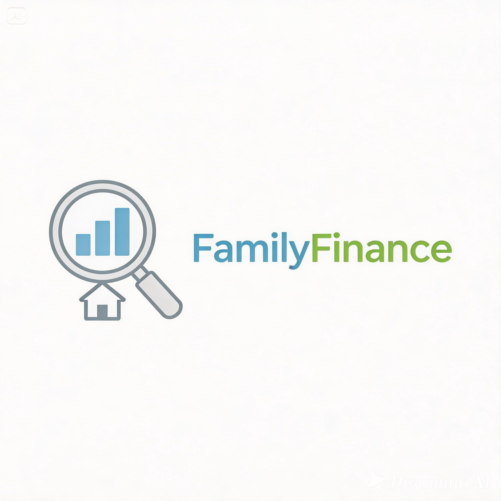
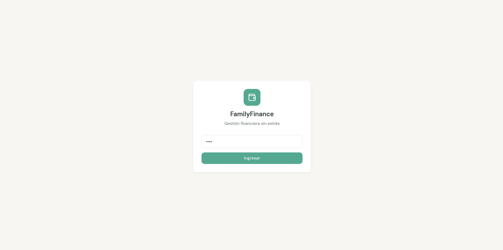
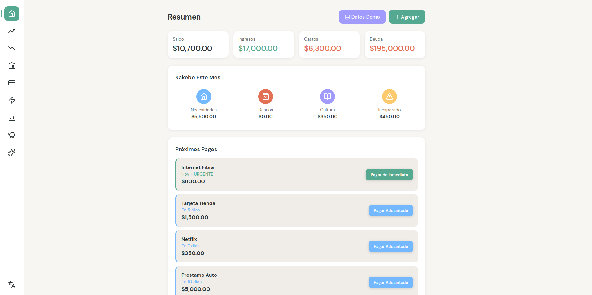

# FamilyFinance

<div align="center">

<!-- Logo -->


### Gestión Financiera Familiar Sin Complejidades

[](https://myfamilyfinance-dkb6bdd9cwhhc4av.centralus-01.azurewebsites.net)
[](https://python.org)
[](https://fastapi.tiangolo.com)
[](https://sqlite.org)
[](LICENSE)

*Tu asistente personal para organizar las finanzas del hogar*

</div>

---

## 📊 Descripción

**FamilyFinance** es una aplicación web de gestión financiera diseñada específicamente para familias hispanohablantes que desean tomar el control de sus finanzas personales sin complicaciones técnicas innecesarias.

La herramienta surge de la necesidad de resolver uno de los problemas más comunes en los hogares: la **falta de visibilidad y control sobre el dinero**. Muchas familias no saben exactamente cuánto gastan, en qué lo gastan, ni cuánto deben en tarjetas y préstamos. FamilyFinance resuelve esto con una interfaz intuitiva, en español, que convierte las finanzas familiares en algo gestionable.

---

## 🎯 Problemas que Resuelve

Las familias hispanohablantes enfrentan desafíos financieros únicos que FamilyFinance aborda directamente:

| Problema | Cómo lo Resuelve |
|----------|------------------|
| **Desconocimiento del gasto mensual** | Registro automático de gastos e ingresos con categorías claras |
| **Deudas ocultas en tarjetas de crédito** | Seguimiento de saldos, intereses y proyecciones de pago |
| **Facturas de servicios olvidadas** | Sistema de recordatorios y seguimiento de pagos de servicios domésticos |
| **Métodos Kakebo poco conocidos** | Implementación del método japonés de gestión financiera familiar |
| **Sin visibilidad del flujo de caja** | Dashboard con resumen financiero mensual y proyecciones |
| **Decisiones financieras reactivas** | Análisis con IA que genera recomendaciones proactivas |

### Dolores Específicos del Hogar

- **Confusión sobre a dónde fue el dinero** a final de mes
- **Sorpresas con facturas de servicios** que no se esperaban
- **Acumulación silenciosa de deudas** en tarjetas de crédito
- **Falta de comunicación financiera** entre pareja o familia
- **Métodos de ahorro complicados** que no se traducen al contexto latino

---

## ✨ Funcionalidades

### 1. Dashboard Integral

Panel principal que muestra:
- Resumen de ingresos vs. gastos del mes
- Próximos pagos pendientes
- Alertas de facturas próximas
- Indicadores de salud financiera

### 2. Registro de Ingresos y Gastos

- Categorización automática (alimentación, transporte, entretenimiento, etc.)
- Filtrado por fecha, categoría y rango de monto
- Visualización mensual y histórica

### 3. Método Kakebo

Implementación del sistema japonés de cuatro preguntas:
- ¿Cuánto dinero recibí?
- ¿Cuánto gasté?
- ¿Cuánto ahorré?
- ¿Cómo puedo mejorar?

### 4. Gestión de Deudas

- Registro de préstamos y deudas
- Cálculo de intereses (simple y compuesto)
- Proyecciones de tiempo hasta liberación
- Comparación de estrategias de pago
- Simulador de escenarios "qué pasaría si"

### 5. Tarjetas de Crédito

- Seguimiento de múltiples tarjetas
- Registro de cargos y pagos
- Proyección de saldo y fecha de corte
- Alertas de proximidad al límite

### 6. Servicios del Hogar

- Gestión de servicios (luz, agua, internet, teléfono)
- Recordatorios automáticos
- Historial de pagos
- Cálculo de promedio de consumo

### 7. Reportes Financieros

- Reporte financiero general
- Análisis Kakebo mensual
- Comparación de deudas
- Exportación a CSV

### 8. Análisis con Inteligencia Artificial

- **Recomendaciones personalizadas**: Consejos basados en tus patrones de gasto
- **Insights**: Descubrimiento de hábitos financieros
- **Anomalías**: Detección de gastos inusuales
- **Pronóstico**: Predicción de flujo de caja futuro
- **Estrategia de deudas**: Plan óptimo para pagar deudas
- **Simulación**: Modelado de escenarios financieros

---

## 🚀 Demo en Vivo

### Acceso Rápido

| Recurso | Enlace |
|---------|--------|
| **Aplicación** | [https://myfamilyfinance-dkb6bdd9cwhhc4av.centralus-01.azurewebsites.net](https://myfamilyfinance-dkb6bdd9cwhhc4av.centralus-01.azurewebsites.net) |
| **Usuario** | (automático) |
| **Contraseña** | `1234` |

### Características de la Demo

- Desplegada en **Azure App Service** (Free Tier - F1)
- Base de datos **SQLite** persistente
- Datos de ejemplo precargados
- Todas las funcionalidades activas

> **Nota**: La demo puede hibernar después de 5 minutos de inactividad en el plan gratuito. Espere 10-20 segundos para que reactive.

---

## 🛠️ Tecnología

### Stack Tecnológico

```
┌─────────────────────────────────────────────────────────────┐
│                      Frontend                               │
│  HTML5 · CSS3 (Tailwind) · JavaScript (Vanilla)             │
└─────────────────────────────────────────────────────────────┘
                              │
                              ▼
┌─────────────────────────────────────────────────────────────┐
│                       Backend                               │
│  Python 3.12 · FastAPI 0.109 · SQLAlchemy 2.0               │
└─────────────────────────────────────────────────────────────┘
                              │
                              ▼
┌─────────────────────────────────────────────────────────────┐
│                      Database                               │
│  SQLite · SQLAlchemy ORM                                    │
└─────────────────────────────────────────────────────────────┘
                              │
                              ▼
┌─────────────────────────────────────────────────────────────┐
│                     Deployment                              │
│  Azure App Service · GitHub Actions · FTP/ZipDeploy         │
└─────────────────────────────────────────────────────────────┘
```

### Dependencias Principales

- **FastAPI**: Framework web asíncrono de alto rendimiento
- **Uvicorn/Gunicorn**: Servidor ASGI
- **SQLAlchemy 2.0**: ORM para gestión de base de datos
- **Pydantic**: Validación de datos
- **Passlib + bcrypt**: Hashing de contraseñas
- **Python-jose**: Manejo de tokens JWT

---

## 💻 Desarrollo Local

### Prerrequisitos

```bash
# Requisitos del sistema
- Python 3.11 o superior
- Git
- Navegador web moderno (Chrome, Firefox, Edge)
```

### Instalación

```bash
# 1. Clonar el repositorio
git clone https://github.com/DiogenesPolanco/FamilyFinance.git
cd FamilyFinance

# 2. Crear entorno virtual (recomendado)
python -m venv venv
source venv/bin/activate  # Linux/Mac
# venv\Scripts\activate   # Windows

# 3. Instalar dependencias
pip install -r requirements.txt

# 4. Ejecutar la aplicación
python -m uvicorn main:app --host 0.0.0.0 --port 8000
# O usar el script preparado:
./run.sh
```

### Acceso Local

1. Abre tu navegador en `http://localhost:8000`
2. La aplicación creará automáticamente un usuario con contraseña `1234`
3. ¡Listo para usar!

### Scripts Disponibles

```bash
./run.sh              # Iniciar servidor de desarrollo
./e2e-tests.sh        # Ejecutar pruebas end-to-end
```

---

## 🌐 Despliegue en Azure

### Configuración de Secrets en GitHub

Ve a tu repositorio → Settings → Secrets and variables → Actions y configura:

| Secret | Descripción | Ejemplo |
|--------|-------------|---------|
| `AZURE_CREDENTIALS` | JSON de Service Principal | `{"clientId": "...", "clientSecret": "...", "subscriptionId": "...", "tenantId": "..."}` |
| `AZURE_WEBAPP_NAME` | Nombre del Web App | `MyFamilyFinance` |
| `AZURE_RESOURCE_GROUP` | Grupo de recursos | `MyRG` |
| `FTP_HOST` | Host FTP de Azure | `waws-prod-...` |
| `FTP_USERNAME` | Usuario FTP | `MyFamilyFinance\$MyFamilyUser` |
| `FTP_PASSWORD` | Contraseña FTP | `*****` |

### Despliegue Automático

El repositorio está configurado con **GitHub Actions** que despliega automáticamente en cada push a `main`:

1. Ejecuta validaciones (tests de i18n)
2. Sube archivos por FTP
3. Despliega por ZipDeploy
4. Configura el comando de inicio

### Verificación Post-Despliegue

```bash
# Verificar que la app responde
curl https://myfamilyfinance-dkb6bdd9cwhhc4av.centralus-01.azurewebsites.net/

# Verificar estado de salud
curl https://myfamilyfinance-dkb6bdd9cwhhc4av.centralus-01.azurewebsites.net/api/auth/status
```

---

## 📸 Capturas de Pantalla

### Pantalla de Login



*Interfaz de acceso simple con contraseña por defecto*

### Dashboard Principal



*Panel principal con resumen financiero y navegación*

---

## 🤝 Contribuir

1. Fork del repositorio
2. Crear branch (`git checkout -b feature/nueva-funcionalidad`)
3. Commit de cambios (`git commit -am 'Agrega nueva funcionalidad'`)
4. Push al branch (`git push origin feature/nueva-funcionalidad`)
5. Crear Pull Request

---

## 📄 Licencia

Este proyecto está bajo la Licencia MIT - ver el archivo [LICENSE](LICENSE) para detalles.

---

## ⚠️ Limitaciones del Plan Gratuito

- **Azure F1**: La app hiberna después de 5 minutos de inactividad
- **Tiempo de activación**: 10-20 segundos para despertar
- **Ancho de banda**: 165 MB/día máximo
- **Uso de CPU**: 60 minutos/día de compute

Para producción, considera actualizar a un plan básico o estándar.

---

## 📞 Soporte

¿Encontraste un bug? ¿Tienes sugerencias?

- Abre un [Issue](https://github.com/DiogenesPolanco/FamilyFinance/issues)
- O contacta directamente al equipo de desarrollo

---

<div align="center">

**FamilyFinance** — *Tu camino hacia la estabilidad financiera familiar*

*Hecho con ❤️ para las familias hispanohablantes*

</div>
